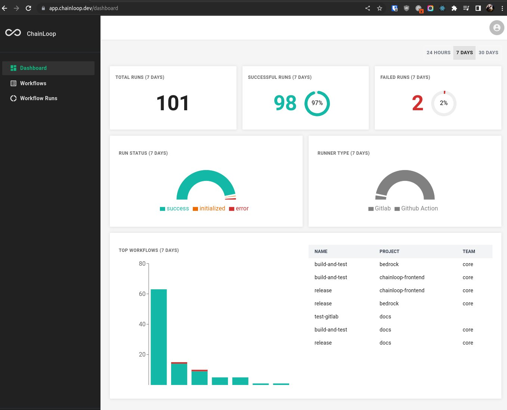
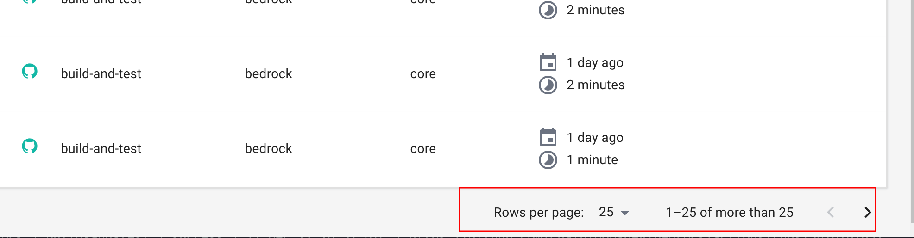

# Changelog

ChainLoop is composed of multiple code bases, this changelog offers a summarized, non-exhaustive, view of any notable, user-facing change. For more information, refer to each project's GitHub repositories.

- This documentation site source code can be found [here](https://github.com/chainloop-dev/frontend).
- React UI frontend source code is available [here](https://github.com/chainloop-dev/frontend).
- The backend control-plane, CLI and artifact CAS have not been open-sourced yet. Stay tuned.

## Unreleased

- Fully functional [frontend web UI](https://github.com/chainloop-dev/frontend).
- [Dependency track](https://dependencytrack.org/) integration support for Software Bill Of Materials handling.
- More components open sourced.

## Public beta - 2022-12-12

The request access requirement has been removed. ChainLoop is available now under **public beta**!

## v0.8.44 - 2022-12-08

- feature(contract): Software Bill Of Materials (SBOM) material type added. CycloneDX and SPDX 2.x JSON formats supported ([docs](http://localhost:3000/reference/operator/contract#material-schema), [contract example](https://github.com/chainloop-dev/docs/blob/main/examples/contracts/skynet.yaml#L22))

## v0.8.40 - 2022-12-07

- feature(controlplane): Organization Metrics endpoint

```console
$ grpcurl api.cp.chainloop.dev:443 list controlplane.v1.OrgMetricsService

controlplane.v1.OrgMetricsService.TopWorkflowsByRunsCount
controlplane.v1.OrgMetricsService.Totals
```

- feature(ui): Metrics added to the UI dashboard



## v0.8.37 - 2022-12-01

- feature(ui): [DSSE](https://github.com/secure-systems-lab/dsse) signed envelope, [in-toto](https://in-toto.io/) statement and denormalized [SLSA](https://slsa.dev/) materials available in the UI.


## v0.8.35 - 2022-11-30

- feat(controlplane): Workflowrun cursor-based pagination

```bash
chainloop wf run ls --next MjAyMi0xMi0xMFQyMTo1MjoyMC4yNjA5NDFaLDQ5MTgzZGNkLTk1N2ItNDEzZS1hMGQ0LWY5NzA1MGQ1MzQ1MA==
```

- feat(ui): Workflow Run pagination



## v0.8.28 - 2022-11-23

- feat(controlplane): grpc-web support
- feat: NextJS + React frontend code. [source](https://github.com/chainloop-dev/frontend), deployed at https://app.chainloop.dev/

## v0.8.20 - 2022-11-17

- feat(controlplane): support for contract creation via URL

```
chainloop workflow contract create --name test \
   -f https://raw.githubusercontent.com/chainloop-dev/docs/main/examples/contracts/skynet.yaml

```

This project adheres to [Semantic Versioning](https://semver.org/spec/v2.0.0.html).

## v0.8.15 - 2022-11-14

- feat: Runner Context support, [docs](https://docs.chainloop.dev/reference/operator/contract#runner-context)
- feat: [GitHub Actions](https://docs.github.com/en/actions) and [Gitlab CI](https://docs.gitlab.com/ee/ci/) runner context support


## v0.8.11 - 2022-11-08

- Custom OCI registry support, [docs](https://docs.chainloop.dev/getting-started/setup#add-oci-repository)

## Older versions

Historical previous version information will not be added to this changelog. Refer to [our documentation](https://docs.chainloop.dev/getting-started/workflow-definition) for more information on all the available features.
